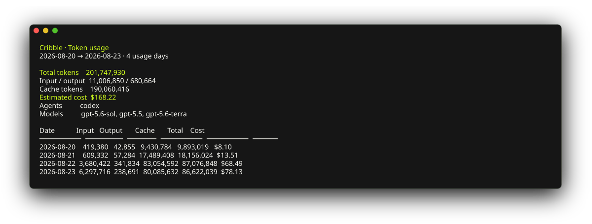

# Cribble Agent

Track local coding-agent token usage and optionally sync it to Cribble.



## Quick start

Requires Node.js 18+.

```sh
npm install
node index.js
node index.js --days 30
```

The CLI reads usage through its bundled [`ccusage`](https://ccusage.com/)
dependency. Use `--json` for machine-readable output.

## Sync

Preview the payload without sending it:

```sh
node index.js sync --dry-run
```

To enable syncing, save a Cribble API key in macOS Keychain, then run a sync:

```sh
node index.js auth set
node index.js sync
node index.js status
```

Optional background sync is macOS-only:

```sh
node index.js background install
node index.js background status
node index.js background uninstall
```

Run `node index.js --help` for all commands and options.

## Development

```sh
npm test
```

See [the product plan](docs/PRODUCT_PLAN.md) for project context.
